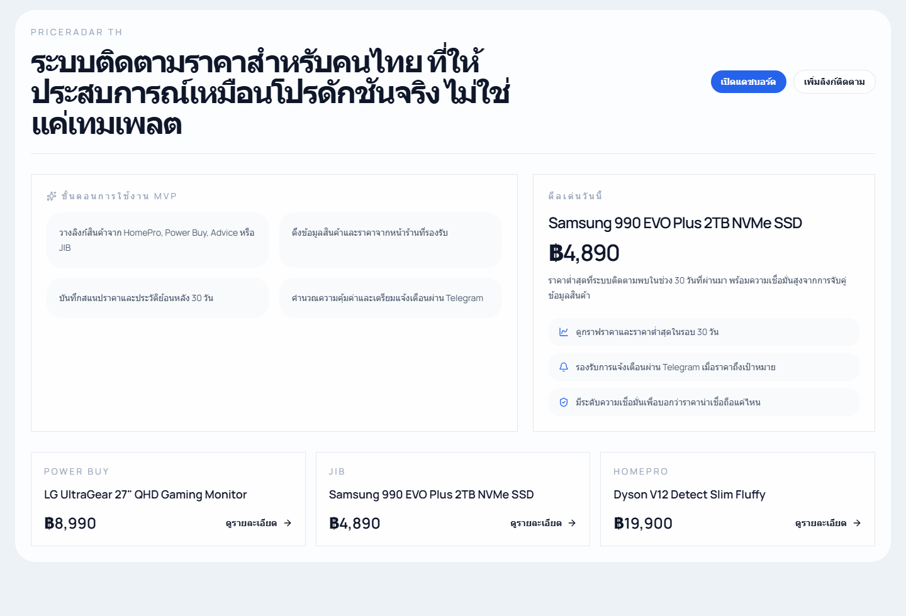
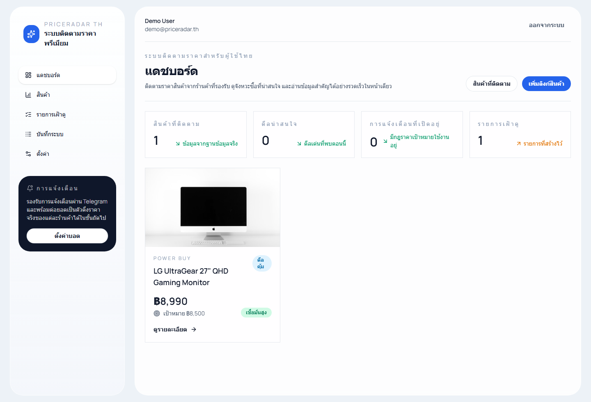
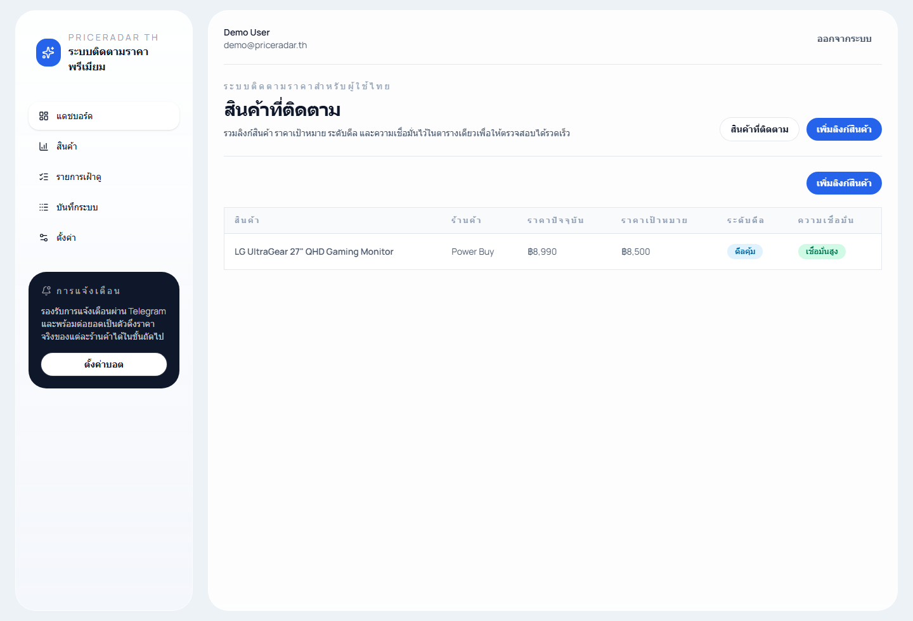
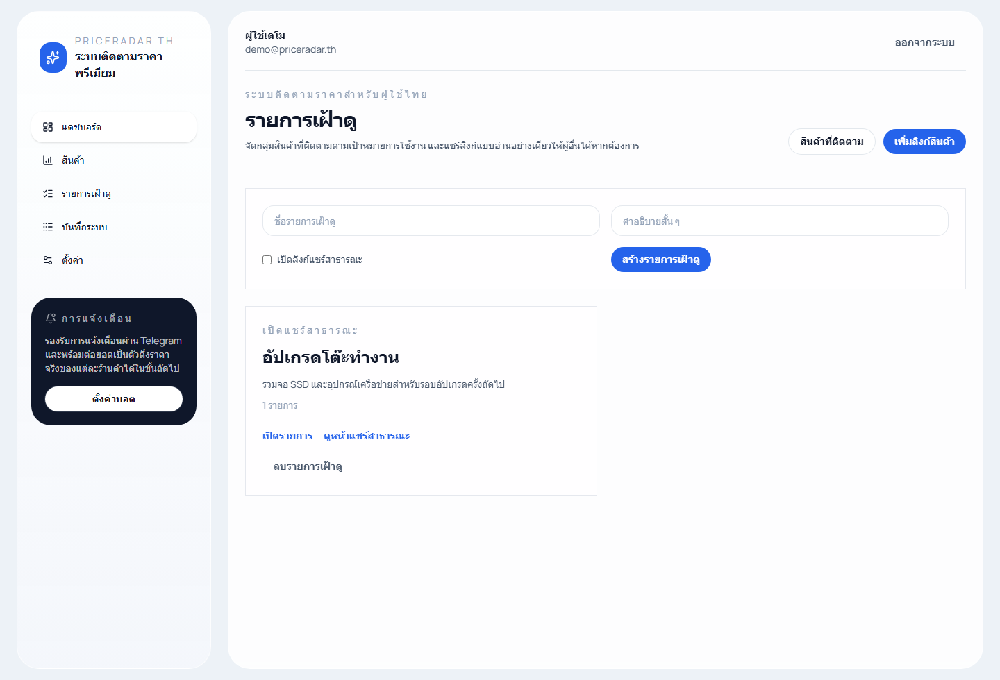

# PriceRadar TH

[ภาษาไทย](./README.th.md)

[](https://github.com/stoprider/priceradar/releases)
[](https://github.com/stoprider/priceradar/releases)
[](./LICENSE)

PriceRadar TH is a Thai-first price tracking app for Thailand e-commerce, with web and Windows desktop distribution.

## Download
Latest desktop builds are available on the [Releases page](https://github.com/stoprider/priceradar/releases).

Current recommended version:
- Windows installer: `v0.1.6`
- Release page: `https://github.com/stoprider/priceradar/releases/tag/v0.1.6`

## Screenshots
Landing page



Dashboard



Tracked products



Watchlists



## Highlights
- Product tracking, watchlists, dashboard, and product detail pages
- Signed cookie auth with seeded demo account
- SQLite-backed desktop runtime for Windows
- GitHub Release-based desktop update flow
- Windows installer build pipeline with Electron
- Telegram alerts for target price and real price drops
- In-app Telegram settings with bot token, chat ID, delivery status, and test send
- Marketplace-ready scraper architecture for future Shopee, Lazada, and Temu adapters

## Stack
- Next.js 16 + TypeScript
- Tailwind CSS
- Prisma + SQLite
- Recharts
- Playwright
- Electron + electron-builder

## Local Development
1. Install dependencies

```bash
npm install
```

2. Create your environment file

```bash
copy .env.example .env
```

3. Prepare the database

```bash
npm run db:generate
npm run db:push
npm run db:seed
```

Demo account:

```text
email: demo@priceradar.th
password: demo12345
```

4. Start the web app

```bash
npm run dev
```

Open `http://localhost:3000`

## Useful Commands
```bash
npm run lint
npm run prices:check
npm run desktop:dev
npm run assets:icons
npm run build:desktop
npm run build:desktop:beta
```

## Windows Desktop Build
Build a Windows installer:

```bash
npm run build:desktop
```

Beta channel build:

```bash
npm run build:desktop:beta
```

Output is written to `dist-desktop/`.

Desktop release builds include:
- branded app and installer icon
- GitHub Release-based update checks
- `latest.yml` metadata for desktop updates

If your shell has `ELECTRON_RUN_AS_NODE=1`, use:

```bash
npm run desktop:dev
```

## Release Environment
Real distribution settings are documented in `.env.release.example`.

Common release variables:
- `GH_TOKEN`
- `PR_UPDATE_CHANNEL=stable` or `beta`
- `CSC_LINK`
- `CSC_KEY_PASSWORD`

## Docker
Run the app with Docker:

```bash
docker compose up --build
```

Endpoints:
- app: `http://localhost:3000`
- health: `http://localhost:3000/api/health`

## Notes
- Production deployment still needs a strong `SESSION_SECRET`.
- Telegram alerts require valid Telegram credentials.
- Live scraping selectors may need maintenance when retailer markup changes.
